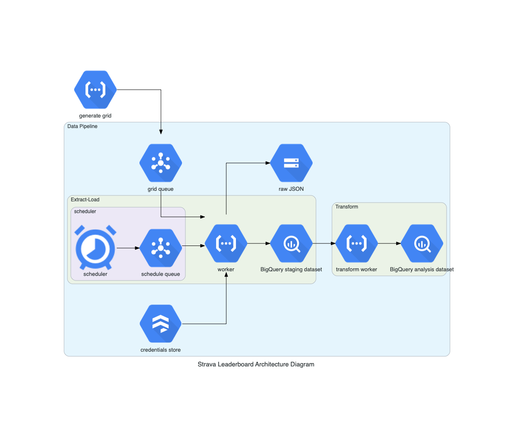

# Strava Leaderboards

A project for the Udacity Data Engineering Nanodegree.

As keen cyclist/runner and Strava user, I'm looking to find interesting segments in my local area (NE London) - popular segments, or those with an achievable KOM/CR. A segment is part of a road or path used by Strava users to compare cycling/running times. The leader of a particular segment is known at the KOM/QOM for cycling and the Course Record holder for running.

Strava has a great API that allows users to search for segments in a particular area based on certain criteria. This project will call the API for my area, store the data in a database

## Data Pipeline

1. `scripts/create_grid`: split a set of coordinates into a grid of (e.g. 100 lateral points by 50 longintudinal points). Push the coorindates to pub/sub.
2.   GCP Cloud Scheduler (cron jobs...) executes the function in (3) every 15 minutes
3. `functions/extract_load`: a Google Cloud Function to get the data from Strava
    - Get a message from the pub/sub topic with a set of coordinates to search
    - Call the [segment explorer](https://developers.strava.com/docs/reference/#api-Segments-exploreSegments) API to get the 10 most popular segments in that area
    - For each segment, get the [segment information](https://developers.strava.com/docs/reference/#api-Segments-getSegmentById)
    - For each segment, get the [leaderboard information](https://developers.strava.com/docs/reference/#api-Segments-getLeaderboardBySegmentId)
    - Write the raw JSON files to Google Cloud Storage
    - Load the data into staging tables in Google BigQuery
4. `functions/strava_key`: a Google Cloud Function to update the Strava access token that expires every 6 hours
5. `scripts/analysis_tables_create`: create the analysis tables in BigQuery
6. `scripts/analysis_tables_load`: load from the staging tables to the analysis tables in BigQuery
 
## Data Model

The data model contains a single fact table of segment leaderboard times:

- Fact table: leaderboard entries
- Dimensions:
    - Segment
    - Location
    - Time and date

 ### Architecture 
 The data pipeline's architecture.
 
 
 

## Infrastructure/Tooling
GCP is decent for data tooling, I'm using it extensively in this project. 

- BigQuery for target storage/analysis
- Cloud Functions for extracting the data
- Cloud Storage to keep copies of the raw segment data
- Pub/sub for a queue of all the points to calculate
- Cloud Scheduler for orchestrating jobs
- Github Actions for CI

If cost was less important, I'd consider using Cloud Composer (managed Airflow) The tooling I've chosen should scale well, but if the volume of data increased by a few orders of magnitude then I'd look to Dataflow (Apache Beam)

## Scenarios for Udacity Project Rubric

1. Data increased by 100x
- The tooling choices for this project should scale well - BigQuery and GCS can handle TBs of data, and I could easily scale the function horizontally.
- I haven't partitioned the data as it stands, but if volume increase by 100x I would probably need to. Either partitioning by date of extract, or location might be a good choice.

2. Pipelines run on a daily basis at 7pm and populate a dashboard
- The pipelines to extract Strava data are scheduled hourly, which load the staging tables. The load of analysis tables `scripts/analysis_tables_load` could be scheduled in a similar way usin GCP Functions and Scheduler.
- A dashboard could be created from the fact and dimension tables as part of this refresh.

3. Database needs to be accessed by 100+ people
- The GCP project has a single user (me) at the moment, but could be configured to be accessed by other users using the usual tooling.